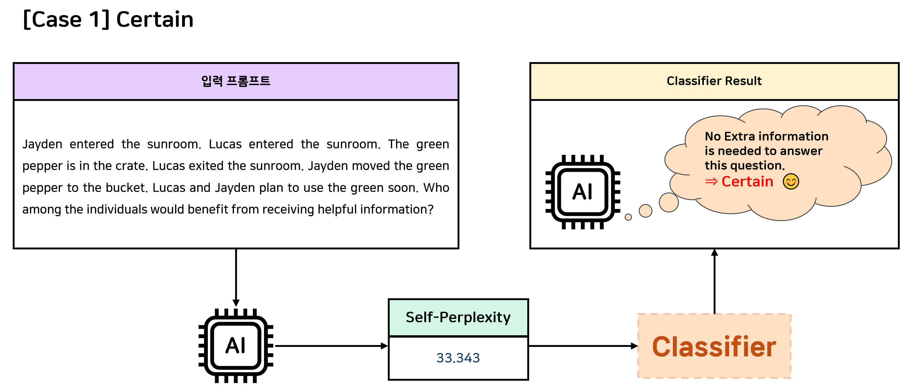
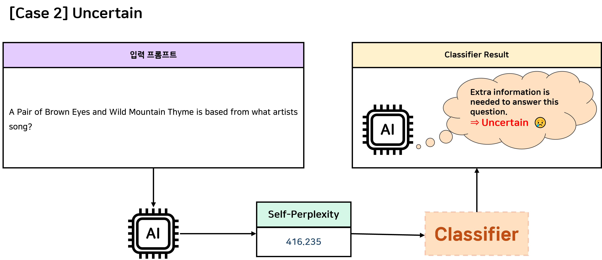

# AGI 발현을 위한 메타인지 프레임워크 핵심기술 개발 및 실증
## AGI 발현을 위한 Planner에 대한 연구 개발
### AI 모델의 내재된 지식을 기반으로 한 Certain / Uncertain (Seen / Unseen) 여부 판단 기법
### 💡 예시
- AI 모델이 **certain**이라고 판단한 경우



- AI 모델이 **uncertain**이라고 판단한 경우 (= 추가 정보가 필요하다고 판단한 경우)



## ⚙️ Requirements
To install requirements:
```
pip install -r requirements.txt
```

## 💻 Usage Guide
### 1. Dataset 준비
- 자세한 내용은 [README.md](data/README.md)를 참고해주세요.

### 2. Classifier 실행
```
python src/classifier.py --dataset_name "dataset_name" --model_name "model_name"
```

## 🧠 작동 원리
### 1️⃣ 질문 입력 및 내부 확률 분포 계산
모델은 input prompt 만을 입력받아, 이에 대한 logits 값을 계산합니다.
이 단계는 모델이 해당 입력을 처리하는 과정에서 얼마나 확신을 가지고 있는지를 평가하기 위한 것으로,
정답을 생성하는 generate() 과정은 필요하지 않습니다.

### 2️⃣ Negative Log-Likelihood (NLL) 및 Perplexity 계산
얻은 logits으로부터 각 토큰의 조건부 확률을 계산하고,
이를 바탕으로 NLL 와 Perplexity 를 산출합니다.
이때 입력 프롬프트 자체에 대해 계산된 Perplexity를 Self-Perplexity 라고 명명합니다.
Self-Perplexity 값이 낮을수록 모델이 해당 입력을 이해하고 처리하는 데 자신이 있다(=Certain)는 뜻이며,
값이 높을수록 해당 입력을 해석하거나 풀 준비가 덜 되어 있다(=Uncertain)고 해석할 수 있습니다.

### 3️⃣ 확신도(Certainty) 판별
계산된 Self-Perplexity가 설정된 임계값(threshold) 이상이면
모델이 해당 입력에 대해 확신 없음(Uncertain)으로 판단하고,
그보다 낮으면 확신 있음(Certain)으로 판단합니다.

### 💡 장점
- 정답 생성 이전 단계에서 모델의 내재적 확신도를 정량적으로 측정할 수 있습니다.
- 질문 난이도 평가나, 외부 지식 검색(RAG) 이 필요한지 여부를 자동 판별하는데 활용할 수 있습니다.
- 레이블 없이, 오직 입력과 모델의 내부 확률 구조만으로 “이 문제를 스스로 풀 자신이 있는가?”를 수치적으로 표현할 수 있습니다.
